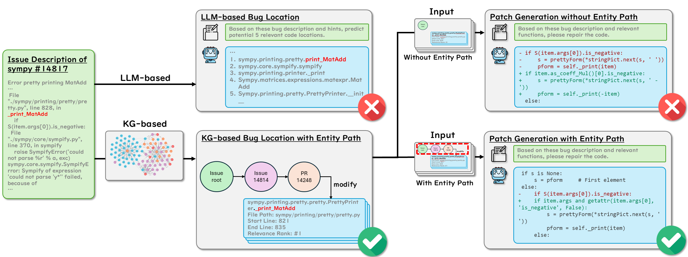
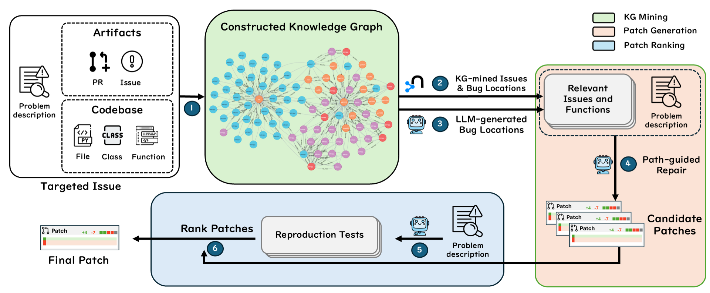
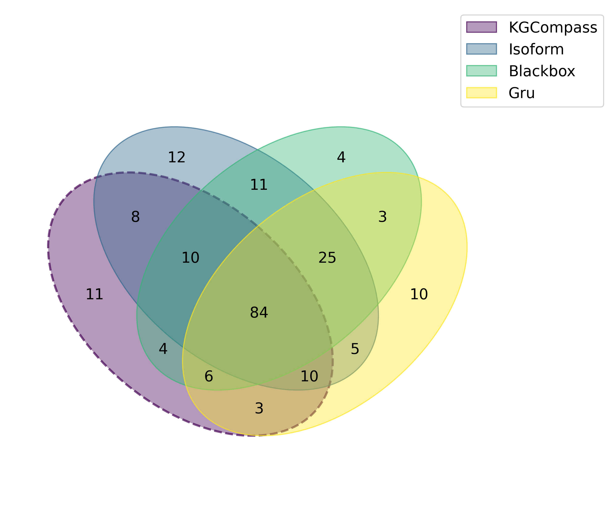
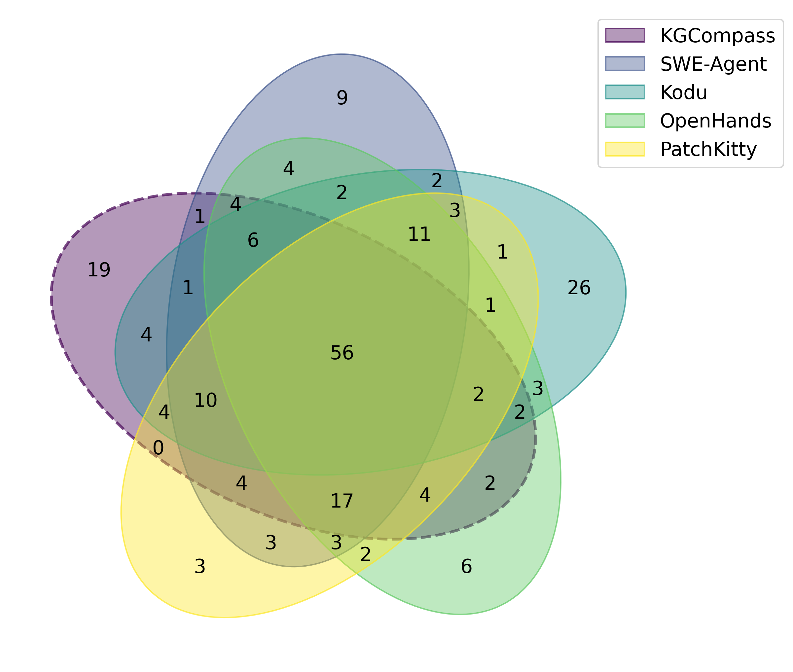
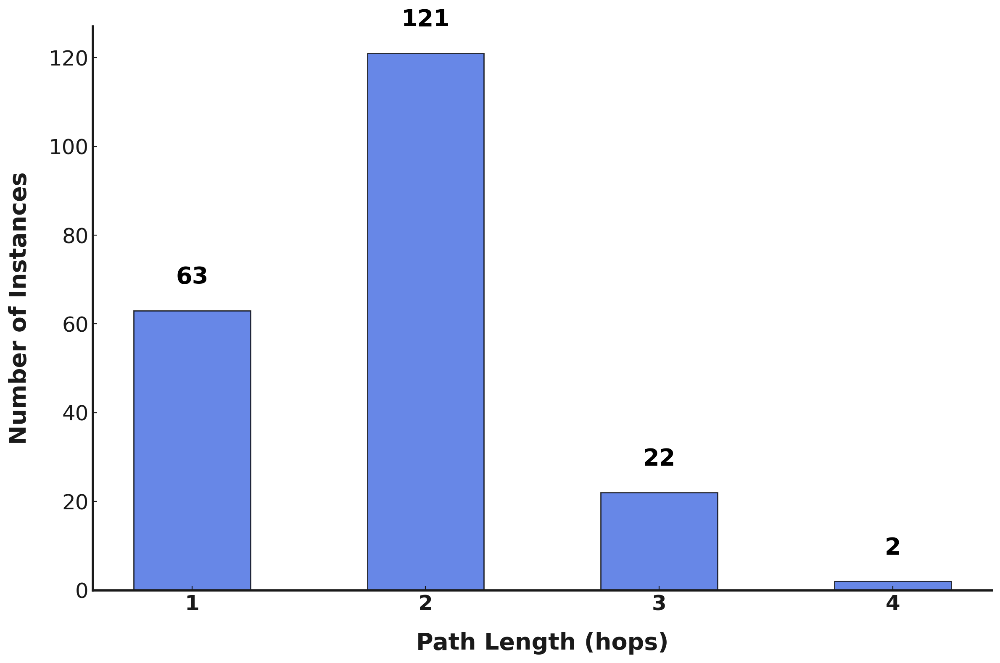
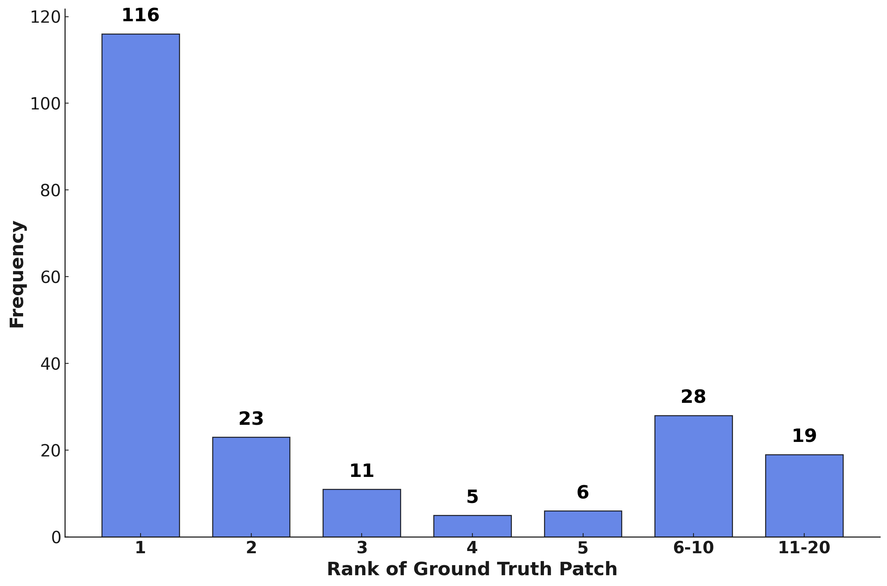

> Enhancing Repository-Level Software Repair via Repository-Aware
> Knowledge Graphs
>
> Boyang Yang1,2, Haoye Tian3,∗, Jiadong Ren1, Shunfu Jin1, Yang Liu4,
> Feng Liu3, Bach Le3
>
> 1School of Information Science and Engineering, Yanshan University
> 2Beijing JudaoYouda Network Technology Co. Ltd. 3University of
> Melbourne 4Nanyang Technological University
>
> yangboyang@jisuanke.com, tianhaoyemail@gmail.com, jdren@ysu.edu.cn,
> jsf@ysu.edu.cn, yangliu@ntu.edu.sg, fengliu.ml@gmail.com,
> bach.le@unimelb.edu.au
>
> Abstract
>
> Repository-level software repair faces challenges in bridging
> se-mantic gaps between issue descriptions and code patches. Existing
> approaches,whichmostlydependonlargelanguagemodels(LLMs), suffer from
> semantic ambiguities, limited structural context under-standing, and
> insuficient reasoning capability. To address these limitations, we
> propose KGCompass with two innovations: (1) a
> novelrepository-awareknowledgegraph(KG)thataccuratelylinks repository
> artifacts (issues and pull requests) and codebase enti-ties (files,
> classes, and functions), allowing us to effectively narrow down the
> vast search space to only 20 most relevant functions with accurate
> candidate bug locations and contextual information, and
> (2)apath-guidedrepairmechanismthatleveragesKG-minedentity path,
> tracing through which allows us to augment LLMs with rele-vant
> contextual information to generate precise patches along with their
> explanations. Experimental results in the SWE-Bench-Lite demonstrate
> that KGCompass achieves state-of-the-art repair per-formance (45.67%)
> and function-level localization accuracy (51.33%) across open-source
> approaches, costing only \$0.20 per repair. Our analysis reveals that
> among successfully localized bugs, 69.7% re-quire multi-hop traversals
> through the knowledge graph, without which LLM-based approaches
> struggle to accurately locate bugs. The knowledge graph built in
> KGCompass is language agnostic and can be incrementally updated,
> making it a practical solution for real-world development
> environments.
>
> 1 Introduction
>
> LargeLanguageModels(LLMs)havedemonstratedremarkablecod-ingcapabilitiesincodegenerationandrepairtasks\[27,31,35,36,45,
> 61\].Theemergenceofrepository-levelrepairbenchmarkslikeSWE-bench
> \[19\] highlights a fundamental challenge: localizing bugs in
>
> \*Corresponding author.
>
> Permission to make digital or hard copies of all or part of this work
> for personal or classroom use is granted without fee provided that
> copies are not made or distributed
> forprofitorcommercialadvantageandthatcopiesbearthisnoticeandthefullcitation
> on the first page. Copyrights for components of this work owned by
> others than the author(s) must be honored. Abstracting with credit is
> permitted. To copy otherwise, or
> republish,topostonserversortoredistributetolists,requirespriorspecificpermission
> and/or a fee. Request permissions from permissions@acm.org.
>
> Conference’17, Washington, DC, USA

© 2025 Copyright held by the owner/author(s). Publication rights
licensed to ACM. ACM ISBN 978-x-xxxx-xxxx-x/YYYY/MM
<https://doi.org/10.1145/nnnnnnn.nnnnnnn>

> large-scale codebases where code modifications require
> compre-hendingrelationshipsacrossmultiplefilesandfunctions\[6,26\].For
> instance, a repository in SWE-bench contains over 2,750 Python
> fileswithover27,000functions\[19\].Recentstudieshaveshownthat
> LLM-based program repair approaches struggle with precise bug
> localization due to context length limitations and deteriorated
> in-ference eficiency and accuracy with extended inputs \[57\], making
> them face significant challenges in repository-level repair \[19\].
>
> To address these repository-level repair challenges, researchers
> haveexploredtwomaincategoriesofapproaches:agentic\[1,11,22, 50, 55\]
> and procedural \[25, 42, 51\]. Agentic approaches equip LLMs with
> various tools for autonomous planning and execution through multiple
> specialized agents, but lack interpretable reasoning and controlled
> decision planning. Procedural approaches mitigate these issues through
> expert-designed workflows, offering more precise
> andinterpretableprocesses\[42,51\].However,bothapproachesrely on
> text-based LLM analysis, which faces inherent semantic ambi-guities
> where syntactically similar terms have distinct meanings in
> differentcontexts\[6,58\].Thisissuealreadyoccursfrequentlywhen
> existing procedural approaches focus on single-location contexts
> alone\[51\].Inpractice,accuratepatchgenerationoftenrequirescon-textualinformationfrommultiplefunctionsandfiles.Consequently,
> the existing approaches still face three major limitations:

① Semantic Ambiguity: LLM-based approaches across various software
engineering tasks inherently struggle with semantic ambiguities when
processing code and natural language \[16, 20\]. This fundamental
limitation becomes particularly critical in repository-level software
repair, where precise bug localization requires understanding complex
semantic relationships across multiple files and components \[6, 58\].
Within large codebases such as SWE-Bench benchmark \[19\], the same
function names frequently have different semantics across different
namespaces or modules, causing LLMs to misidentify bug locations. Even
state-of-the-art open-source approaches achieve less than 50% accuracy
in function-level localization on SWE-Bench-Lite, con-firming semantic
ambiguity as a critical bottleneck in repository-level repair.

② Limited Structural Understanding: Repository-level code-related tasks
require comprehending connections between repos-itory artifacts and code
entities \[34, 37\]. While LLMs and ex-isting knowledge graph approaches
excel at analyzing textual content or structural relationships among
code entities, they

> Conference’17, July 2017, Washington, DC, USA Yang et
> al. style="width:6.86514in;height:2.57175in" />
>
> Figure 1: Motivating Example
>
> do not address the essential connections between repository artifacts
> (issues and pull requests) and codebase entities (files, classes, and
> functions) \[19, 43\]. Only 32.0% of SWE-Bench-Lite bugs contain
> direct location information \[51\], yet all reference repository
> artifacts. Furthermore, existing approaches typically focus on
> leveraging a single bug location rather than multiple
> relevantlocationsprovidingthecontextforeffectiverepairs.This
> disconnect between documentation and implementation signifi-cantly
> limits understanding code relationships, directly reducing
> localization precision and repair accuracy.

③ Lack of Decision Interpretability: Repository-level software repair
requires traceable reasoning chains to validate the repair decisions
\[3\]. While existing state-of-the-art approaches have achieved
promising results, they lack interpretable decision pro-cesses in bug
localization and patch generation \[47\]. Current
agenticapproaches\[1,50,55\]oftenmakedecisionsthroughcom-plex black-box
interactions without clear reasoning paths, while procedural approaches
\[42, 51\] rank multiple candidate patches but provide limited insight
into their final choices for users. On SWE-Bench-Lite, while
state-of-the-art open-source approaches
achievea45.67%successrate,theyfailtoprovidetransparentrea-soning
information, limiting both trustworthiness and practical adoption.

> This paper. We present KGCompass, a novel approach that
> ac-curatelylinkcodestructurewithrepositorymetadataintoaunified
> database, namely a knowledge graph, to achieve more accurate and
> interpretable software repair. Given a natural language bug report and
> a repository codebase, our approach constructs a knowl-edge graph that
> captures relationships between repository artifacts (issues and pull
> requests) and codebase entities (files, functions, classes). This
> unified representation allows us to effectively trace the semantic
> connection between bug descriptions and potential
> buglocations,reducingthesearchspacefromthousandsto20most relevant
> candidates that accurately provide both bug locations and
> contextualinformation.Theusefulcontextualinformationprovided
> fromtheknowledgegraphisthenusedtohelpLLMsgeneratemore accurate
> patches.
>
> Experimental results show that KGCompass achieves state-of-the-art
> performance among open-source approaches on the
> SWE-bench-litebenchmarkusingClaude3.5Sonnet(45.67%)atonly\$0.20 per
> repair. KGCompass also demonstrates superior function-level
> localization accuracy (51.33%) and provides interpretable reasoning
> chains for repair decisions. Additionally, our analysis shows that
> 69.7% of successfully localized bugs required multi-hop traversals
> from the start issue through the knowledge graph, demonstrating the
> necessity of leveraging indirect entity relationships from the
> knowledge graph. While ablation studies validate the effectiveness of
> our approach overall, the gap between current performance (45.67%) and
> the upper bound (47.67%, achieved when validating with the benchmark’s
> ground truth tests) suggests promising op-portunities for future
> improvements in patch validation techniques.
>
> Our main contributions are:
>
> • Repository-Aware Knowledge Graph: We propose a method
> toconstructrepository-awareknowledgegraphthatunifiescode-baseentities(files,classes,andfunctions)andissue-relatedrepos-itory
> artifacts (issues and pull requests), effectively modeling both
> structural dependencies and semantic relationships across the
> repository.
>
> • KG-based Repair Approach: We introduce KGCompass, a knowledge
> graph-based approach for repository-level software repair that
> augments LLMs with graph analysis, e.g., structural and semantic
> dependencies between code and artifacts, to iden-tify relevant bug
> locations and generate accurate patches.
>
> • Eficient Search Space Reduction: We achieve significantly lower
> costs (\$0.20 per repair) through our candidate selection approach
> that narrows down from thousands to 20 relevant
> func-tions,successfullycapturing84.3%ofgroundtruthfilesand58.8% of
> ground truth functions containing actual bug locations.
>
> • Comprehensive Experimental Evaluation: Comprehensive experimental
> evaluation on SWE-Bench-Lite demonstrates
> KG-Compass’shighestrepairaccuracy(45.67%)andsuperiorfunction-level
> localization accuracy (51.33%) among all open-source ap-proaches \[1,
> 3, 22, 50, 51, 55\]. Further ablation studies confirm the
> effectiveness of each component in our approach.
>
> Enhancing Repository-Level Software Repair via Repository-Aware
> Knowledge Graphs
>
> 2 Motivating Example
>
> We present a motivating example from SWE-Bench-Lite \[19\], a
> benchmark for evaluating repository-level software repair. This
> exampleillustratesthebenefitsoftheknowledgegraphconstructed in our
> approach in both pinpointing the correct buggy location and generating
> the correct repair.
>
> Knowledge Graph-guided Bug Localization. As shown in Fig-ure 1, the
> problem statement of instance sympy-14814 within SWE-Bench-Lite
> describes an error when printing matrix expressions with special
> characters. When instructed to locate the bug based on the problem
> statement, Claude 3.5 Sonnet incorrectly identi-fies “print_MatAdd” as
> the primary candidate function, missing the critical underscore prefix
> in the ground truth bug location “\_print_MatAdd”. This example
> highlights how LLMs inherently
> strugglewithsemanticambiguitieswhenprocessingcodeasnatural language,
> misinterpreting syntactically similar terms with distinct meanings. By
> contrast, the knowledge graph approach KGCompass precisely
> disambiguates functions with identical or similar names by capturing
> their structural relationships and execution contexts,
> effectivelyaddressingafundamentallimitationinpurelytext-based code
> understanding. By analyzing entity relationships within the knowledge
> graph, we identify that issue \#14814 links to pull re-quest \#14248,
> which in turn points to the correct “\_print_MatAdd” function with the
> highest relevance score.
>
> This case illustrates a typical pattern in repository-level soft-ware
> repair, where bug locations are indirectly referenced through
> repository artifacts rather than explicitly stated. For the problem
> statement of each instance within SWE-Bench-Lite, while 68.0% of
> instances lack direct bug location information \[51\], most instances
> reference repository artifacts (issues and pull requests) or codebase
> entities (files, classes, functions). These references create valuable
> contextual connections, as repository artifacts often contain bug
> re-ports, stack backtraces, and discussions about code changes, while
> codebase entities provide structural relationships and implemen-tation
> details. They help establish semantic connections between natural
> language descriptions and relevant code locations. Knowledge
> Graph-guided Repair. As shown in Figure 1, even when the function
> “\_print_MatAdd” is correctly identified, Claude
> 3.5Sonnetproducesaweakfixusing“item.as_coeff_Mul()\[0\].is_neg ative”
> that fails when processing expressions with special charac-ters like
> “y\*”. However, when given the entity path (issue root → \#14814 →
> \#14248 → “\_print_MatAdd”) from the knowledge graph, the LLM
> generates a robust solution using “getattr(item.args\[0\],
> ’is_negative’, False)”. The contextual information associated with
> this path includes comments in issue \#14814 referencing PR \#14248,
> suggesting that “\_print_MatAdd” should use the same methods as
> “\_print_Add” for handling plus or minus signs. This contextual
> information guides the LLM to adopt a more defensive program-ming
> approach rather than directly accessing attributes that might not
> exist. The “getattr” solution safely handles cases where the
> “is_negative” attribute is unavailable, addressing the core weak-ness
> in the previous implementation. This case demonstrates how structural
> context from the knowledge graph helps LLMs identify
> relevantcodepatternsandrelationshipsthatwouldbemissedwhen analyzing
> isolated code segments.
>
> Conference’17, July 2017, Washington, DC, USA
>
> Notably, neither the procedural state-of-the-art approach Agent-less
> \[51\] nor the agentic state-of-the-art approach SWE-Agent \[55\]
> could fix this instance, motivating our approach KGCompass to combine
> structural and textual information for more precise bug localization
> and successful patch generation.
>
> 3 Approach

We present KGCompass, a repository-level software repair frame-work that
constructs a knowledge graph, through which it enables LLMs to locate
accurate candidate bug locations and generate cor-rect patches. Figure 2
illustrates our approach, which unfolds in
threephases:knowledgegraphmining,patchgeneration,andpatch ranking.

> In the Knowledge Graph Mining phase, (i) we construct a comprehensive
> knowledge graph by integrating multiple informa-tion sources from
> codebases and GitHub artifacts, including issues and pull requests.
> (ii) Then, we identify top candidate bug locations by extracting the
> 15 highest-scoring functions from the graph and (iii) augmenting them
> with up to 5 additional candidates suggested by the LLM. In the Patch
> Generation phase, (iv) we supply the LLM with these candidate bug
> locations, accompanied by corre-sponding source code and relevant
> entity paths within the graph structure. In the Patch Ranking phase,
> (v) we leverage LLM to generate reproduction tests and (vi) utilize
> both LLM-generated reproduction tests and regression tests within
> codebases to evalu-ate and rank the generated candidate patches, then
> select the final patch that is most likely to resolve the target
> issue.
>
> 3.1 Knowledge Graph Mining

The Knowledge Graph mining phase constructs a comprehensive knowledge
graph by analyzing problem statements to extract
enti-tiesandtheirrelationships,enablingustomodelbothstructuraland
semantic connections that are critical for accurate bug localization.

> Weextracttwocategoriesofentities:repositorystructureentities (issues
> and pull requests) and codebase entities (files, classes, and
> functions). For codebase entities, we perform Abstract Syntax Tree
> (AST) parsing to analyze containment and reference relationships
> between files, classes, and functions. For repository structure
> enti-ties,weapplyregularexpression-basedparsingtoextractreferences to
> code entities within textual content, establishing relationships
> between repository artifacts and codebase entities. To address data
> leakage, we strictly use only artifacts with timestamps before the
> benchmark instance’s created_at, simulating the
> informa-tionavailabletodeveloperswhentheissuewasreportedinpractice. To
> prioritize stronger relationships during path finding, we treat the
> edge weight as a distance, such that smaller values indicate closer
> connections.
>
> After constructing the knowledge graph, we compute each func-tion
> entity’s relevance score 𝑆(𝑓) through a novel formula that combines
> semantic similarity with structural proximity:
>
> 𝑆(𝑓) = 𝛽𝑙(𝑓) · (𝛼· cos(𝑒𝑖,𝑒𝑓) + (1−𝛼) · lev(𝑡𝑖,𝑡𝑓)) (1)
>
> Where 𝑓 represents a candidate function entity in the knowl-edge
> graph,𝑒𝑖and𝑒𝑓 are embeddings of the problem description and function
> entity 𝑓respectively, cos(·,·) is cosine similarity, 𝑡𝑖
>
> Conference’17, July 2017, Washington, DC, USA Yang et
> al. style="width:6.6552in;height:2.75913in" />
>
> Figure 2: Overview of KGCompass

and𝑡𝑓 are textual representations of the problem description and
function entity 𝑓, lev(·,·) is Levenshtein similarity normalized to
\[0,1\], 𝑙(𝑓) is the weighted shortest path length from the issue node
to function entity 𝑓using Dijkstra’s algorithm \[9\]. The
hyper-parameter 𝛼controls the balance between semantic embedding
similarity and textual similarity, following the finding of \[4\] that

this combination effectively captures both contextual meaning and
surface-level textual patterns. Lower 𝛼values prioritize surface-level
textual matches crucial for identifying syntactically similar but
semantically distinct code elements. The path length decay

factor 𝛽determines how quickly relevance decreases with path distance
through the exponential decay function 𝛽𝑙(𝑓). This func-tion, adopted
from prior work \[60\], effectively models relevance

> decay with graph distance while preserving meaningful multi-hop
> relationships.
>
> Based on these relevance scores𝑆(𝑓), we select the top 15 func-tions
> from the knowledge graph to provide candidate bug locations and
> context information. We then use an LLM to identify up to 5 potential
> bug locations from the problem statement, complement-ing candidate
> locations with semantic understanding. This hybrid approach combines
> the strengths of knowledge graph-based struc-tural analysis and
> LLM-based textual understanding, creating a
> comprehensivesetofupto20candidatefunctionsforthefollowing patch
> generation phase.
>
> 3.2 Patch Generation

The patch generation phase leverages the identified candidates and graph
context to generate patches. KGCompass augments the LLM prompt with path
information that illustrates structural con-nections (function calls,
containment relationships, and references
fromrepositoryartifacts).ThepromptprovidedtotheLLMconsists of three key
components: (1) the issue description, (2) KG-mined relevant functions
with entity paths (formatted as Figure 3), and (3) a structured format
specifying how to produce search/replace edits \[12, 51\]. The entity
path explicitly traces connections from

> relevant functions to the targeted issue through intermediate
> en-tities like files, functions, issues, and pull requests.
> Incorporating KG-mined context enables KGCompass to reason about the
> role and relevance of each relevant function.
>
> \### \[full file path\]
>
> \- signature: \[namespace\].\[class\].\[function name\](\[params\])
>
> \- path_info: \[function reference\] -\> \[relation type\] -\>
> \[entity 1\] -\> \[relation type\] -\> \[entity 2\] -\> ... -\> root
>
> \- start_line: \[start\] - end_line: \[end\]
>
> ...
>
> \[function code\] ...
>
> Figure 3: KG-mined Relevant Function Format with Entity Path for Bug
> Repair
>
> To address LLMs’ inherent context limitations and balance pre-cision
> with diversity, KGCompass employs a hybrid sampling strat-egy,
> combining deterministic (temperature = 0.0) and exploratory
> (temperature \> 0.0) sampling methods during patch generation.
> Deterministic sampling ensures stability and consistency, while
> ex-ploratory sampling introduces diversity to cover alternative viable
> repair scenarios.
>
> Generated patches commonly suffer from syntactic errors due to
> incorrectindentation\[30\].Toaddressthis,KGCompassimplements an
> adaptive indentation correction algorithm (Algorithm 1) that
> systematically tests minor indentation adjustments (±1, ±2 levels) and
> selects syntactically valid variants, recovering 2% of invalid
> patches. All syntactically valid patches are then passed to the
> sub-sequent patch ranking phase for evaluation through regression and
> reproduction tests.
>
> 3.3 Patch Ranking

The patch ranking phase integrates reproduction test generation and
patch prioritization to provide a comprehensive evaluation framework for
selecting optimal repair solutions.

> Enhancing Repository-Level Software Repair via Repository-Aware
> Knowledge Graphs Conference’17, July 2017, Washington, DC, USA
>
> Algorithm 1 Adaptive Indentation Correction Strategy 4.2 Metrics
>
> 1: INPUT: Generated patch 𝑃, Original code𝑆 2: OUTPUT: Syntactically
> valid patch 𝑃′ or null 3: 𝑃′ ← ApplyPatch(𝑃,𝑆)
>
> 4: if IsSyntaxValid(𝑃′) and 𝑃′ ≠ 𝑆then 5: return 𝑃′
>
> 6: end if
>
> 7: 𝐼𝑛𝑑𝑒𝑛𝑡𝐿𝑒𝑣𝑒𝑙𝑠← {−1,1,−2,2} 8: for𝑖∈ 𝐼𝑛𝑑𝑒𝑛𝑡𝐿𝑒𝑣𝑒𝑙𝑠do
>
> 9: 𝑃𝑖 ← AdjustIndentation(𝑃,𝑖) 10: 𝑃′ ← ApplyPatch(𝑃𝑖,𝑆)
>
> 11: if IsSyntaxValid(𝑃′) and 𝑃′ ≠ 𝑆then 12: return 𝑃′
>
> 13: end if 14: end for
>
> 15: return null {No valid adjustment found}
>
> In the reproduction test generation process, KGCompass utilizes a
> prompt that combines the issue description with 20 KG-mined relevant
> functions. Reproduction tests are specialized test cases dy-namically
> generated by LLMs to simulate the exact conditions and environment,
> verifying whether a patch addresses the proposed issue. Using
> Deepseek-V3 \[8\], KGCompass iteratively generates tests that
> reproduce the described issue, averaging 113 valid re-production tests
> per iteration and successfully generating at least one reproduction
> test for 203 (67.7%) instances in the SWE-Bench-Lite benchmark. All
> generated tests are executed within isolated Docker \[10\] containers
> to ensure testing consistency and repro-ducibility.
>
> The patch prioritization process employs a multi-tiered ranking
> strategy.Foreachsyntacticallyvalidpatch,weevaluatefourmetrics in
> descending priority: (1) regression test passing count, strictly
> limitedtoonlythoseteststhattheoriginalcodebasealreadypassed,
> (2)reproductiontestpassingcount,(3)majorityvotingacrossmodel-generated
> patches, and (4) normalized patch size. Larger patches are preferred
> when other criteria are equal, assuming they consider a broader range
> of edge cases. The highest-ranked patch is selected as the final
> solution.
>
> 4 Experimental Setup 4.1 Benchmark

We evaluate KGCompass on SWE-bench-lite \[19\], a benchmark comprising
300 instances from 11 large-scale Python projects with natural language
issue descriptions, codebase snapshots, and test cases. SWE-bench-lite
presents distinct challenges from existing benchmarks in two aspects:
unlike single-file benchmarks (such as TutorCode \[53\], Humaneval-Java
\[18\]) or repository-level bench-marks with explicit bug locations
(such as Defects4J \[21\]), it pro-vides only natural language
descriptions, requiring approaches to
firstlocalizebugsbeforerepairingthem.Thissignificantlyincreases
dificulty as approaches must bridge the semantic gap between
de-scriptions and code entities within the codebase. For instance, the
Django repository within SWE-Bench-Lite contains 2,750 Python files with
27,867 functions, highlighting the substantial localization challenge
without location guidance.

We follow standard evaluation practices for automated program repair and
bug localization \[38, 43, 51, 57\], adopting the top-1 suc-cess
criterion widely used in SWE-Bench-Lite \[19\], which considers only the
highest-ranked patch for each instance when determining success
orfailure. We employfour keymetrics: (1)% Resolved: the
primarymetricmeasuringthepercentageofbugssuccessfullyfixed
withpatchesthatpassalltestcases;(2)localizationprecisionatboth % File
Match and % Func Match levels, comparing the bug loca-tions of
LLM-generated patches with ground truth patches; and (3) Avg Cost per
repair instance, measuring computational eficiency across the complete
pipeline. Accurate bug localization metrics are key for real-world
software development \[51, 57\]. Among these metrics, % Func Match
provides the best level of detail for evaluat-ing bug localization,
representing a natural organizational unit in software development
practices \[43\]. For multi-function bugs (17% instances of
SWE-Bench-Lite), we adopt a strict matching criterion requiring the
identification of all affected functions. While success-ful fixes may
occur at different locations than in the ground truth, which reflects
the reality of multiple valid or plausible patches for specific bugs,
comparing against ground truth patches provides consistent metrics that
have been shown to correlate with overall repair capability \[51\].

> 4.3 Implementation Details

We use neo4j \[39\] for building the knowledge graph with plugins
apoc-4.4\[41\]andgds-2.6.8\[40\].KGCompassintegratesstate-of-the-art
LLMs and embedding models in a task-specific manner: Claude 3.5 \[2\]
for bug location and patch generation; Deepseek-V3 \[8\] for
cost-eficient test generation. Our knowledge graph construction uses
jina-embeddings-v2-base-code \[15\] for semantic embeddings, which was
selected because it is the only open-source embedding model specifically
designed for mixed natural language and code content in software
repositories, which can accurately capture se-mantic relationships
between issue descriptions and code entities. We empirically determined
the hyper-parameters through initial parameter exploration, setting 𝛽=
0.6 for path length decay and 𝛼=
0.3fortheembedding-textualsimilaritybalanceinKGCompass. We employ
multiple temperature settings: 0.8 for test generation to promote
diversity, 0 for deterministic LLM-based bug localization, and
temperatures 0 and 0.8 for mixture patch generation, following previous
empirical studies \[46, 62\].

> 4.4 Research Questions
>
> • RQ-1: How effective is KGCompass in repository-level soft-ware
> repair compared to state-of-the-art approaches? We
> evaluatetheKGCompass’sperformancebycomparingrepairsuc-cess rates,
> localization accuracy, and computational costs against existing
> open-source approaches, supported by case studies ana-lyzing its
> strengths and limitations.
>
> • RQ-2: How does the knowledge graph construction within KGCompass
> contribute to bug localization? We analyze the effectiveness of our
> repository-aware knowledge graph in identi-fying relevant functions,
> examining multi-hop relationships and path structures connecting issue
> descriptions to bug locations.

Conference’17, July 2017, Washington, DC, USA Yang et
al.

||
||
||
||
||
||
||

> Table 1: Comparison of Top Open-Source Software Repair Approaches on
> SWE-Bench-Lite \[19\]

• RQ-3: What are the impact
of different components in KG-Compass on repair performance? Through
ablation studies, we evaluate the contributions of key components,
including can-didate function selection strategies, entity path
information in patch generation, various patch ranking approaches, and
differ-ent top-k configurations to understand their individual effects
on repair success.

5 Experiments & Results

5.1 RQ-1: Effectiveness of KGCompass

\[Objective\]: We aim to evaluate KGCompass’s effectiveness in
repository-level software repair by comparing its repair success
rate,localizationaccuracy,andcostagainstexistingstate-of-the-art
approaches.
\[ExperimentalDesign\]:First,wecompareKGCompasswithstate-of-the-art
open-source approaches, including SWE-Agent 1.0 \[55\], Kodu \[22\],
OpenHands \[50\], PatchKitty, and Composio \[1\], using the
SWE-bench-lite \[19\] benchmark. We implement KGCompass following the
configuration detailed in Section 4.3. We evaluate these approaches
using four types of metrics: success rate (“Re-solved”), localization
accuracy at both file and function levels (“% File Match” and “% Func
Match”), and average cost per repair (“Avg Cost”), as detailed in
Section 4.2. Additionally, we perform intersec-tion analysis for both
open-source and closed-source approaches to identify whether KGCompass
can uniquely resolve bugs that other approaches cannot fix.

||
||
||
||
||
||
||

> Table 2: Token and Cost Statistics of KGCompass

\[Experimental Results\]: We evaluate KGCompass’s performance
againstexistingopen-sourceapproachesinTable1.WithClaude3.5, KGCompass
achieves state-of-the-art performance across multiple dimensions. In
terms of repair success, KGCompass resolves 45.67%

Figure 4: Intersection Analysis of KGCompass Against Lead-ing
Open-Source Results

Figure 5: Intersection Analysis of KGCompass Against Lead-ing
Closed-Source Results

of bugs, matching the performance of SWE-Agent 1.0 while outper-forming
other approaches like Kodu (44.67%), OpenHands (41.67%),

> Enhancing Repository-Level Software Repair via Repository-Aware
> Knowledge Graphs
>
> and PatchKitty (41.33%). Notably, SWE-Agent 1.0 was developed by the
> SWE-Bench-Lite benchmark team \[19, 55\], making our perfor-mance
> particularly significant as we outperform the benchmark au-thors’
> solution in both function-level match rate (51.33% vs 49.67%) and
> repair success (45.67% vs 45.33%) at substantially lower cost (\$0.20
> vs \$2.18). As detailed in Table 2, this \$0.20 cost per repair breaks
> down to \$0.12 for input of patch generation processing, \$0.05 for
> output of patch generation process, \$0.01 for bug location, and
> \$0.03 for test generation processing. KGCompass with ground truth
> tests validation ("@6") further improves the repair pass rate to
> 47.67% while maintaining the same cost.
>
> AsshowninFigure4,KGCompassuniquelyresolves19casesthat no other
> open-source approaches can fix. Comparing KGCompass with
> state-of-the-art closed-source systems (Figure 5), including Isoform
> \[17\], Blackbox \[5\], and Gru \[13\], reveals it can uniquely
> address 11 bugs that none of these commercial solutions could handle.
> This underscores KGCompass’s distinct advantage in cap-turing fix
> opportunities missed by open-source and proprietary approaches,
> highlighting its potential in practical repair scenarios.
> Closed-source approaches such as Isoform \[17\] only provide
> evalu-ation results for each instance without patch content,
> preventing us from conducting a more comprehensive and in-depth
> analysis.
>
> \[RQ-1\]Findings:(1)KGCompassachievesstate-of-the-artrepair
> performance (45.67%) and function-level match rate (51.33%) on
> SWE-Bench-Lite, outperforming other open-source approaches. (2)
> KGCompass costs only \$0.20 per repair, significantly lower than other
> open-source approaches. Insights: Knowledge graph-based approaches
> show potential for repository-level software repair by bridging
> semantic gaps between issue descriptions and code.
>
> Conference’17, July 2017, Washington, DC, USA
>
> Figure 6: Path Length Distribution for Ground Truth Bug Locations
>
> Files Issues
>
> Pull Requests
>
> 15% Functions
>
> 5% 6%

Figure 7: Intermediate Entity Types in KG Paths to Ground Truth
Locations

>  style="width:3.16978in;height:2.0972in" />5.2 RQ-2: Contribution of
> Knowledge Graph to Bug Localization
>
> \[Objective\]: We aim to evaluate how the knowledge graph con-tributes
> to KGCompass’s performance by examining its effective-ness in
> identifying and ranking relevant functions that contain bug locations,
> thereby enhancing repair eficiency and reducing costs. \[Experimental
> Design\]: We analyze the structure and effective-ness of the knowledge
> graph in connecting issue descriptions to bug locations. First, we
> evaluate the coverage of ground truth bug locations within KG-mined
> candidates to assess how effectively the knowledge graphidentifies
> relevantfunctions. Second, weexamine the hop distribution in paths
> leading to ground truth bug locations to understand the importance of
> multi-hop traversals that pure LLM-based approaches fundamentally
> cannot achieve through tex-tual analysis. Third, we analyze the
> composition of intermediate entity types along these paths to
> understand how the knowledge graph integrates both codebase entities
> and repository artifacts to form comprehensive connections. Finally,
> we analyze the ranking effectiveness of our candidate functions to
> assess the performance of our relevance scoring formula (Equation 1).

\[Experimental Results\]: First, we evaluated the coverage of ground
truth bug locations within KG-mined top 20 relevant func-tions. Our
analysis reveals that KG-mined top 20 relevant functions cover 84.3% of
file-level and 58.8% of function-level ground truth bug locations. This
remarkably high coverage while reducing the

> Figure 8: Rank of Ground Truth Patch in KG Candidates
>
> search space from thousands to just 20 candidate functions
> demon-strateshowKGCompasssimultaneouslyimprovesperformanceand reduces
> computational costs.
>
> Next, we analyzed path structures within the knowledge graph to
> evaluate its effectiveness in modeling repository relationships.
> AsillustratedinFigure8,asignificantfindingemergesfromthehop
> distribution required to reach all 208 ground truth bug functions
> across 154 successfully localized instances in our benchmark: Only
>
> Conference’17, July 2017, Washington, DC, USA
>
> 30.3% (63 functions) can be reached via direct single-hop
> connec-tions, while 69.7% require multi-hop traversals. Specifically,
> 58.2% (121 functions) necessitate two hops, and 11.5% (24 functions)
> re-quire three or more hops. This predominance of multi-hop paths
> (69.7%) empirically validates our knowledge graph-based approach,
> demonstrating that most bug-location relationships cannot be cap-tured
> through direct LLM-based textual matching alone but instead require
> the leveraging of intermediate entities that establish seman-tic
> bridges between issue descriptions and buggy functions.
>
> Analysis of paths leading to ground truth bug locations reveals that
> repository artifacts (issues and pull requests) constitute 11% of
> intermediate entities, as shown in Figure 7. This is particularly
> noteworthyconsideringthevastquantityofcodeentitiescompared to
> repository artifacts in typical projects, highlighting the critical
> importance of these artifacts in establishing semantic connections.
> This result empirically validates KGCompass of integrating reposi-tory
> artifacts (issues and pull requests) into the knowledge graph mining.
>
> The ranking effectiveness of our approach is demonstrated in Figure 8,
> which shows that 55.77% of ground truth patches are ranked in the
> first position within our top-20 relevant functions.
> ThispreciserankingcapabilityiscrucialtoKGCompass’seficiency-performance
> balance, as our patch generation strategy creates mul-tiple candidate
> patches where half utilize only the top 10 relevant functions. Our
> similarity scoring formula (Equation 1) effectively combines embedding
> similarity, textual similarity, and path length information to
> identify the most promising repair locations, al-lowing KGCompass to
> achieve higher performance at significantly lower cost by focusing
> computational resources on the most rele-vant functions.
>
> \[RQ-2\] Findings: (1) Most (69.7%) of the ground truth bug func-tions
> require multi-hop traversal within the knowledge graph, empirically
> validating the necessity of modeling indirect rela-tionships. (2)
> KG-mined top 20 relevant functions significantly reduce the search
> space while maintaining high coverage (84.3% file-level, 58.8%
> function-level) and ranking precision (55.77% of ground truth patches
> ranked first), simultaneously lowering com-putational costs and
> improving repair performance. Insights: Repository-aware knowledge
> graphs effectively bridge the seman-tic gap between issue descriptions
> and bug locations by capturing both direct and indirect structural
> relationships that pure LLM-based textual approaches cannot model.
>
> 5.3 RQ-3: Impact of Components on KGCompass’s Repair Performance
>
> \[Objective\]: This experiment aims to understand the individual
> contributions of different components within KGCompass, includ-ing bug
> localization, knowledge graph construction, path-guided repair, and
> patch ranking strategies.

\[Experimental Design\]: We perform ablation studies to isolate and
evaluate the impact of each component in KGCompass. Specif-ically, we
first evaluate different relevant function selection strate-gies by
comparing LLM-based with KGCompass’s hybrid KG+LLM approach. Next, we
examine the role of entity path information
duringpatchgenerationtoassesshowstructuralcontextinfluences

> Yang et al.
>
> repair accuracy. We then analyze various patch ranking strategies to
> determine the most effective configuration for selecting the best
> patches.Additionally,weinvestigatedifferentTop-kconfigurations for
> patch generation to understand how candidate diversity affects repair
> success. Through these comprehensive ablations, we analyze how each
> component of KGCompass contributes to overall bug localization and
> repair accuracy.
>
> \[Experimental Results\]: We conducted ablation studies on three key
> components: relevant functions selection, entity path in repair
> generation, and patch ranking strategies.
>
> First, we evaluated different relevant functions selection
> strate-gies, as shown in Table 3. The LLM-based strategy, which also
> selects the top 20 candidates through contextual analysis of the
> problem statement, achieves 81.0% file-level and 53.9%
> function-levelcoverage.Ourhybridcandidateselectionstrategy(KG+LLM),
> whichleveragesbothknowledgegraphandLLMcapabilities,yields the best
> performance with 84.3% file-level and 58.8% function-level coverage of
> ground truth locations. These results demonstrate that augmenting
> LLM-based semantic understanding with knowledge graph structural
> relationships improves the identification of rele-vant functions for
> repair.

||
||
||
||
||

> Table 3: Performance Between LLM-based and Hybrid Can-didate Selection
> Strategies
>
> We analyzed the impact of KG-mined entity path information
> duringpatchgeneration.AsshowninTable4,usingClaude3.5Son-net,providingpathinformationimprovedthesuccessratefrom102
> (34.00%) to 108 (36.00%) instances, under a setting of temperature 0.0
> to remove randomness, ensuring that the observed improve-ment is
> solely attributed to the KG-mined entity path information. This
> improvement suggests that the structural context provided by entity
> paths extracted from the knowledge graph helps the LLM better
> understand the relationships between code components and generate more
> accurate patches. As shown in Section 2, the specific case involving
> matrix expressions was successfully repaired when the LLM was provided
> with entity path information. In contrast, without this path
> information, it generated an incomplete solu-tion that failed to
> handle edge cases with special characters. This demonstrates how path
> information can guide the LLM toward considering broader
> implementation contexts and alternative code paths that might be
> overlooked when working solely with isolated code segments.

||
||
||
||
||

> Table 4: Ablation Study of Entity Path Information

We examined different patch ranking strategies as detailed in Ta-ble 5.
We incorporated the Model Patch Size prioritization strategy

> Enhancing Repository-Level Software Repair via Repository-Aware
> Knowledge Graphs
>
> that prefers larger patches when regression and reproduction test
> results are equal, assuming they consider a broader range of edge
> cases. Our comparative evaluation demonstrates that this approach
> yields measurable improvements, increasing repair success from 114
> (38.00%) to 121 (40.33%) instances when applied to majority voting,
> and from 124 (41.33%) to 129 (43.00%) instances when
> com-binedwithregressiontests.Greedysamplingresolved108instances
> (36.00%), while combining regression and reproduction tests with
> “Model Patch Size” achieved an accuracy of 45.67%. Recent work has
> shown that test prioritization strategies can impact APR efi-ciency
> \[32\], and our results further demonstrate this importance in patch
> ranking. Notably, when using ground-truth tests for evalua-tion,
> KGCompass resolved 143 instances (47.67%), indicating room for
> improvement in patch ranking techniques.
>
> Conference’17, July 2017, Washington, DC, USA

\[RQ-3\] Findings: (1) Entity path information utilized during patch
generation improves success patches from 102 to 108 under temperature
0.0, demonstrating the consistent improvement from the structural
context of the entity path. (2) The hybrid KG+LLM approach significantly
outperforms the pure LLM-based approach for bug localization, with 4.0%
higher file-level coverage and 9.1%
higherfunction-levelcoverageofgroundtruthlocations.Insights: Entity
paths provide critical contextual information in repository-level coding
tasks by connecting issue descriptions with relevant code locations
through intermediate entities, enhancing the LLM’s understanding of
implementation constraints and relationships not explicitly stated in
the bug description.

> 6 Discussion
>
> 6.1 Case Study of Failed Instance
>
> Ranking Strategy Model Patch Size Resolved Greedy Sampling – 108
> (36.00%)
>
> without 114 (38.00%) with 121 (40.33%)
>
> \+ Regression tests without 124 (41.33%)
>
> \+ Reproduction tests without 129 (43.00%)
>
> Ground-truth tests – 143 (47.67%) Table 5: Ablation Study of Patch
> Ranking Strategies
>
> Finally,weexaminedhowgeneratingdifferentnumbersofcandi-date patches
> affects performance. Table 6 compares KGCompass’s
> best-rankingstrategyandthetheoreticalupperbound,representing the
> maximum achievable performance if the optimal patch were always
> selected. Performance improves steadily from 36.00% with a single
> candidate to 45.67% with six candidates. The small gap between our
> best result (45.67%) and the upper bound (47.67%) validates the
> effectiveness of the KGCompass’s ranking strategy.

||
||
||
||
||
||

> Table 6: Top-k with Best Ranking Strategy
>
> This case study illustrates the strengths and limitations of
> KGCom-pass when handling semantically complex database operations. We
> examine instance django-12589, which involves an ambiguous “GROUP BY”
> clause that causes SQL errors. The issue manifests in Django 3.0 when
> executing queries with certain field annotations, resulting in the
> error: “ProgrammingError: column reference status is ambiguous”. This
> represents a particularly challenging case for LLM-based repair
> approaches, as it requires a deep understanding of both SQL semantics
> and Django’s ORM implementation details across versions.
>
> KGCompassattemptstorepairtheissuebymodifyingthemethod set_group_by in
> db/models/sql/query.py, demonstrat-ing the effectiveness of the
> repository-aware knowledge graph in accurately localizing the fault.
> KGCompass correctly identifies set_group_by as the primary candidate
> (following the path: root issue → query.py → set_group_by),
> successfully resolving the semantic ambiguity problem through
> structural re-lationships where none of the other open-source
> approaches
> haveevensucceededinlocalizingthisbug.However,whileKGCom-pass generates
> a patch that disables aliasing when an alias conflicts with column
> names gathered from all joined tables, the ground truth patch disables
> aliasing based on column names extracted from the JOINed models.
> Although KGCompass achieves a partial fix, the repair remains
> incomplete because the LLM-based patch generation relies on
> surface-level context \[33, 36, 56\] and lacks the domain-specific
> knowledge necessary for this scenario \[14, 24, 44\]. Thus, while
> KGCompass successfully addresses the semantic am-biguity challenge for
> bug localization, further improvement of the LLM-based patch
> generation process is required to resolve such issues.
>
> 6.2 Evaluation on Other Open-Source LLMs
>
> While KGCompass demonstrates strong performance with Claude 3.5, we
> further evaluated its generalizability across different LLMs,
> including Deepseek V3 \[8\] and Qwen2.5 Max \[52\]. As shown in Table
> 7, our approach maintains consistent effectiveness across LLMs, with
> even open-source LLMs achieving repair rates (36.67% and 33.33%) that
> surpass previous state-of-the-art approaches with
> closed-sourceLLMs.Notably,KGCompasswithDeepseekV3(36.67%)
>
> Conference’17, July 2017, Washington, DC, USA
>
> and Qwen2.5 Max (33.33%) both outperforms closed-source ap-proaches
> like CodeFuse \[7\], MarsCode Agent + GPT 4o \[30\], and Alibaba
> Lingma Agent \[37\], demonstrating that the knowledge
> graph-basedarchitectureenablesevenopen-sourceLLMstoachieve superior
> performance compared to closed-source LLMs.

||
||
||
||
||

> Table 7: Performance Comparison across Different LLMs
>
> 6.3 Practical Applications
>
> KGCompass offers several advantages for real-world deployment.
> First,theKGrequiresonlyincrementalupdateswhencodechanges occur or new
> issues are submitted, with only referenced entities needing updates,
> enabling eficient KG retrieval in production en-vironments. Second,
> KGCompass is extensible across program-ming languages, where core
> components of KGCompass remain language-independent due to its
> repository-aware design that pri-marily models natural language
> entities (issues and pull requests) and their relationships with
> codebase entities. The system can leverage third-party abstract syntax
> tree parsers to process dif-ferent languages while keeping most of the
> KG construction pro-cess unchanged. Even in the worst-case scenario
> where complete repository reconstruction is required, KGCompass
> averages only 238.75s for the process within SWE-Bench-Lite (while
> incremen-tal updates would be significantly faster) and reproduction
> tests running asynchronously in parallel, KGCompass eficiently
> inte-grates into development workflows, automatically locating bugs,
> generating patches, and proposing fixes through existing code re-view
> systems. Finally, KGCompass demonstrates scalability with
> largecodebases,suchasDjango,whichincludes2,750+Pythonfiles and 27,000+
> functions. These advantages position KGCompass as a valuable tool for
> real-world software development.
>
> 7 Threats to Validity
>
> Internal Validity. Internal validity concerns potential experimen-tal
> biases that could affect result fairness. To prevent this, we
> en-forced strict temporal constraints in our knowledge graph
> con-struction, incorporating only issues and pull requests before each
> benchmark instance’s creation time, preventing knowledge leakage from
> future artifacts. Similarly, for patch evaluation, we used only
> regression tests that passed successfully in the original codebase
> before the bug’s introduction, ensuring fair assessment of repair
> capabilities.
>
> External Validity. External validity concerns the generalizabil-ity of
> our findings. Though SWE-Bench-Lite focused on Python repositories,
> KGCompass’s architecture is fundamentally language-independent. The
> core methodology of constructing knowledge
> graphsthatconnectrepositoryartifactswithcodeentitiesandlever-agepathinformationtoguiderepairscanbeappliedacrossdifferent
> programming languages. The repository-aware design primarily
> modelsrelationshipsbetweennaturallanguageartifacts(issuesand
>
> Yang et al.
>
> pullrequests)andcodestructures,makingtheunderlyingapproach
> transferabletodiversedevelopmentenvironmentsregardlessofthe
> implementation language.
>
> Construct Validity. Construct validity concerns whether we ac-curately
> measure what we claim to evaluate. To address this, we employed
> multiple complementary metrics: repair success rate (“Resolved”),
> localization accuracy at file and function levels (“File Match” and
> “Func Match”), and computational eficiency (“Avg
> Cost”).BycomparingKGCompass’sgeneratedpatcheswithground truth patches,
> we provided validation beyond test-passing success, helping identify
> truly correct fixes rather than merely coincidental solutions that
> happen to pass tests.
>
> 8 Related Works
>
> 8.1 Repository-level Software Repair
>
> Recent large language models (LLMs) have demonstrated remark-able
> capabilities in repository-level software repair tasks \[50, 51, 54,
> 58\]. SWE-Bench-Lite \[19\] provides a representative benchmark of 300
> real-world GitHub issues, making it suitable for evaluating LLM-based
> software repair approaches. Repository-level repair ap-proaches fall
> into two categories: Agentic approaches coordinate multiple
> specialized agents through observe-think-act loops \[1, 22,
> 48–50,55,58\].OpenHands\[49,50\]employsagentsinteractingwith sandbox
> environments, while AutoCodeRover \[48, 58\] leverages
> hierarchicalcodesearchforrepositorynavigation.Composio\[1\]im-plementsastate-machinemulti-agentsystemusingLangGraph\[23\],
> and SWE-agent \[55\] introduces specialized tools for LLM
> interac-tions. Procedural approaches employ expert-designed sequential
> workflows for repair \[3, 11, 51, 58\]. Agentless \[51\] employs a
> three-phase repair, including localization, repair, and patch
> validation. Moatless \[3, 42\] proposed that rather than relying on an
> agent to reasonitswaytoasolution,itiscrucialtobuildgoodtoolstoinsert
> the right context into the prompt and handle the response.
>
> Pure LLM-based approaches process repository artifacts and
> codeasseparateentitiesratherthaninterconnectedentities,lacking the
> ability to bridge the gap between natural language issues and
> structured codebase. In contrast, KGCompass explicitly LLMs both
> structural codebase and semantic relationships across repository
> artifacts through knowledge graphs.
>
> 8.2 Knowledge Graph for Repository-level Software
>
> Knowledge graphs have emerged as a powerful approach for
> mod-elingcoderepositoriesbycapturingcomplexrelationshipsbetween code
> entities and their dependencies. \[28, 29, 43, 59\]. Recent work has
> demonstrated the effectiveness of knowledge graphs in un-derstanding
> software repository. RepoGraph \[43\] operates at a fine-grained code
> line level, demonstrating that modeling explicit definition-reference
> relationships can effectively guide repair de-cisions. GraphCoder
> \[28\] introduces control flow and dependency analysis into code
> graphs, showing that structural code relation-ships are critical for
> understanding code context and predicting the subsequent statements in
> completion tasks. CodeXGraph \[29\] represents code symbols and their
> relationships in graph databases,
>
> Enhancing Repository-Level Software Repair via Repository-Aware
> Knowledge Graphs
>
> proving that querying graph structures enables more precise re-trieval
> of relevant code snippets than traditional sequence-based approaches.

Existinggraph-basedapproachesfocusmainlyoncodestructure
whileoverlookingkeyrepositoryartifacts(issuesandpullrequests) and fail
to leverage indirect entity relationships for patch
genera-tion.KGCompassintegratesrepositoryartifactsintotheknowledge graph
and introduces path-guided repair, strengthening the link between issues
and relevant functions and enabling more precise repairs.

> 9 Conclusion
>
> ThispaperintroducesKGCompass,leveragingtheknowledgegraph to improve
> repository-level software repair through two key in-novations. First,
> the repository-aware knowledge graph uniquely integrates repository
> artifacts with the codebase, reducing search space from thousands to
> the top 20 candidates. Second, the path-guided repair mechanism
> leverages graph relationships to provide critical contextual
> information and improve repair accuracy. Eval-uation on SWE-Bench-Lite
> demonstrates state-of-the-art perfor-mance (45.67%) with superior
> localization accuracy (76.67% file-level, 51.33% function-level) at
> only \$0.20 per repair, significantly outperforming competing
> approaches in both effectiveness and eficiency. Our analysis reveals
> that 69.7% of successfully localized bugs required multi-hop
> traversals through the knowledge graph, empirically validating the
> necessity of modeling indirect relation-ships that pure LLM-based
> textual approaches cannot capture. The knowledge graph built in
> KGCompass is language agnostic and can be incrementally updated,
> making it a practical solution for real-world development
> environments. Future research could focus
> onintegratingdomain-specificknowledgeintothegraphtoprovide LLMs with
> critical contextual information, including framework-specific
> behaviors, API usage, and basic programming knowledge, while
> addressing the cold start problem for new projects with lim-ited
> development history.
>
> References
>
> \[1\] 2024. Composio.dev. <https://composio.dev/>
>
> \[2\] Anthropic. 2023. Claude 3.5: A New Milestone in AI Language
> Models. [https:](https://www.anthropic.com/news/claude-3-5-sonnet)
> [//www.anthropic.com/news/claude-3-5-sonnet](https://www.anthropic.com/news/claude-3-5-sonnet)
> Accessed: 2025-02-19.
>
> \[3\] Antonis Antoniades, Albert Örwall, Kexun Zhang, Yuxi Xie,
> Anirudh Goyal, and WilliamWang.2024.
> SWE-Search:EnhancingSoftwareAgentswithMonteCarlo Tree Search and
> Iterative Refinement. arXiv preprint arXiv:2410.20285 (2024).
>
> \[4\] Andrea Ballatore, Michela Bertolotto, and David C Wilson. 2015.
> A structural-lexical measure of semantic similarity for geo-knowledge
> graphs. ISPRS Interna-tional Journal of Geo-Information 4, 2 (2015),
> 471–492.
>
> \[5\] BlackBox.\[n.d.\]. BLACKBOX.AI. <https://www.blackbox.ai>
> Accessed:2025-03-01. \[6\] Dong Chen, Shaoxin Lin, Muhan Zeng,
> Daoguang Zan, Jian-Gang Wang, Anton
> Cheshkov,JunSun,HaoYu,GuoliangDong,ArtemAliev,etal.2024. CodeR:Issue
> Resolving with Multi-Agent and Task Graphs. arXiv preprint
> arXiv:2406.01304
>
> (2024).
>
> \[7\] CodeFuse. 2025. CodeFuse: Make R & D Simpler.
> <https://codefuse.ai/>
>
> \[8\] DeepSeek-AIetal.2024. DeepSeek-V3TechnicalReport.
> arXiv[:2412.19437](https://arxiv.org/abs/2412.19437)\[cs.CL\]
> <https://arxiv.org/abs/2412.19437>
>
> \[9\] Edsger W Dijkstra. 1959. A note on two problems in connexion
> with graphs. \[10\] Docker. \[n.d.\]. Docker - Build, Share, and Run
> Your Applications. [https://www.](https://www.docker.com/)
>
> [docker.com/](https://www.docker.com/) Accessed: 2025-03-01.
>
> \[11\] Anmol Gautam, Kishore Kumar, Adarsh Jha, Mukunda NS, and Ishaan
> Bhola. 2024. SuperCoder2. 0: Technical Report on Exploring the
> feasibility of LLMs as Autonomous Programmer. arXiv preprint
> arXiv:2409.11190 (2024).
>
> \[12\] Paul Gauthier. 2024. Aider is ai pair programming in your
> terminal.
>
> \[13\] Gru. \[n.d.\]. Gru.ai \| Hire your first coding gru.
> <https://gru.ai> Accessed: 2025-03-
>
> 01\.
>
> Conference’17, July 2017, Washington, DC, USA

\[14\] Xiaodong Gu, Meng Chen, Yalan Lin, Yuhan Hu, Hongyu Zhang,
Chengcheng Wan, Zhao Wei, Yong Xu, and Juhong Wang. 2024. On the
effectiveness of large language models in domain-specific code
generation. ACM Transactions on Software Engineering and Methodology
(2024).

\[15\] Michael Günther, Jackmin Ong, Isabelle Mohr, Alaeddine
Abdessalem, Tanguy Abel, Mohammad Kalim Akram, Susana Guzman, Georgios
Mastrapas, Saba Sturua, Bo Wang, Maximilian Werk, Nan Wang, and Han
Xiao. 2024. Jina Em-beddings 2: 8192-Token General-Purpose Text
Embeddings for Long Documents.
arXiv[:2310.19923](https://arxiv.org/abs/2310.19923) \[cs.CL\]
<https://arxiv.org/abs/2310.19923>

\[16\] Xinyi Hou, Yanjie Zhao, Yue Liu, Zhou Yang, Kailong Wang, Li Li,
Xiapu Luo, David Lo, John Grundy, and Haoyu Wang. 2024. Large language
models for software engineering: A systematic literature review. ACM
Transactions on Software Engineering and Methodology 33, 8 (2024), 1–79.

\[17\] ISOForm. 2025. ISOForm: Transforming Protein Biology with AI.
[https://www.](https://www.isoform.ai/)
[isoform.ai/](https://www.isoform.ai/)

\[18\] Nan Jiang, Kevin Liu, Thibaud Lutellier, and Lin Tan. 2023.
Impact of Code Language Models on Automated Program Repair. In 2023
IEEE/ACM 45th In-ternational Conference on Software Engineering (ICSE).
1430–1442. [doi:10.1109/](https://doi.org/10.1109/ICSE48619.2023.00125)
[ICSE48619.2023.00125](https://doi.org/10.1109/ICSE48619.2023.00125)

\[19\]
CarlosEJimenez,JohnYang,AlexanderWettig,ShunyuYao,KexinPei,OfirPress,
and Karthik R Narasimhan. 2024. SWE-bench: Can Language Models Resolve
Real-world Github Issues?. In The Twelfth International Conference on
Learning Representations. <https://openreview.net/forum?id=VTF8yNQM66>

\[20\]
HaolinJin,LinghanHuang,HaipengCai,JunYan,BoLi,andHuamingChen.2024. From
llms to llm-based agents for software engineering: A survey of current,
challenges and future. arXiv preprint arXiv:2408.02479 (2024).

\[21\] René Just, Darioush Jalali, and Michael D. Ernst. 2014.
Defects4J: a database of existing faults to enable controlled testing
studies for Java programs. In Proceed-ings of the 2014 International
Symposium on Software Testing and Analysis (San Jose, CA, USA) (ISSTA
2014). Association for Computing Machinery, New York, NY, USA, 437–440.
[doi:10.1145/2610384.2628055](https://doi.org/10.1145/2610384.2628055)

\[22\] Kodu. 2024. Kodu.ai. <https://www.kodu.ai/>

\[23\] LangChain. 2024. LangGraph: Manage LLM agent state and logic as a
graph. <https://www.langchain.com/langgraph> Accessed: 2025-03-01.

\[24\] Fengjie Li, Jiajun Jiang, Jiajun Sun, and Hongyu Zhang. 2024.
Hybrid automated program repair by combining large language models and
program analysis. ACM Transactions on Software Engineering and
Methodology (2024).

\[25\]
HongweiLi,YuhengTang,ShiqiWang,andWenboGuo.2025.PatchPilot:AStable and
Cost-Eficient Agentic Patching Framework. arXiv preprint
arXiv:2502.02747 (2025).

\[26\] Jiawei Liu, Chunqiu Steven Xia, Yuyao Wang, and Lingming Zhang.
2024. Is your code generated by chatgpt really correct? rigorous
evaluation of large language models for code generation. Advances in
Neural Information Processing Systems 36 (2024).

\[27\] Kui Liu, Shangwen Wang, Anil Koyuncu, Kisub Kim, Tegawendé F
Bissyandé, Dongsun Kim, Peng Wu, Jacques Klein, Xiaoguang Mao, and Yves
Le Traon. 2020. On the eficiency of test suite based program repair: A
systematic assessment of 16 automated repair systems for java programs.
In Proceedings of the ACM/IEEE 42nd International Conference on Software
Engineering. 615–627.

\[28\] Wei Liu, Ailun Yu, Daoguang Zan, Bo Shen, Wei Zhang, Haiyan Zhao,
Zhi Jin, and Qianxiang Wang. 2024. GraphCoder: Enhancing
Repository-Level Code Completion via Coarse-to-fine Retrieval Based on
Code Context Graph. In Pro-ceedings of the 39th IEEE/ACM International
Conference on Automated Software Engineering. 570–581.

\[29\] XiangyanLiu,BoLan,ZhiyuanHu,YangLiu,ZhichengZhang,FeiWang,Michael
Shieh, and Wenmeng Zhou. 2024. Codexgraph: Bridging large language
models and code repositories via code graph databases. arXiv preprint
arXiv:2408.03910 (2024).

\[30\] Yizhou Liu, Pengfei Gao, Xinchen Wang, Jie Liu, Yexuan Shi, Zhao
Zhang, and ChaoPeng.2024. Marscodeagent:Ai-nativeautomatedbugfixing.
arXivpreprint arXiv:2409.00899 (2024).

\[31\] Yu Liu, Sergey Mechtaev, Pavle Subotić, and Abhik Roychoudhury.
2023. Pro-gram repair guided by datalog-defined static analysis. In
Proceedings of the 31st ACM Joint European Software Engineering
Conference and Symposium on the Foundations of Software Engineering.
1216–1228.

\[32\] Yiling Lou, Jun Yang, Samuel Benton, Dan Hao, Lin Tan, Zhenpeng
Chen, Lu Zhang, and Lingming Zhang. 2024. When Automated Program Repair
Meets Re-gressionTesting—AnExtensiveStudyonTwoMillionPatches.
ACMTransactions on Software Engineering and Methodology 33, 7 (2024),
1–23.

\[33\] En Low, Carmen Cheh, and Binbin Chen. 2024. Repairing
Infrastructure-as-Code using Large Language Models. In 2024 IEEE Secure
Development Conference (SecDev). IEEE, 20–27.

\[34\] Qinyu Luo, Yining Ye, Shihao Liang, Zhong Zhang, Yujia Qin, Yaxi
Lu, Yesai Wu, Xin Cong, Yankai Lin, Yingli Zhang, et al. 2024.
Repoagent: An llm-powered open-source framework for repository-level
code documentation generation. arXiv preprint arXiv:2402.16667 (2024).

\[35\] Wenqiang Luo, Jacky Wai Keung, Boyang Yang, He Ye, Claire Le
Goues, TegawendeF.Bissyande,HaoyeTian,andBachLe.2024.
WhenFine-TuningLLMs

Conference’17, July 2017, Washington, DC, USA

> Meets Data Privacy: An Empirical Study of Federated Learning in
> LLM-Based Program Repair.
> arXiv[:2412.01072](https://arxiv.org/abs/2412.01072) \[cs.SE\]
> <https://arxiv.org/abs/2412.01072>

\[36\] Michael R Lyu, Baishakhi Ray, Abhik Roychoudhury, Shin Hwei Tan,
and Patana-mon Thongtanunam. 2024. Automatic programming: Large language
models and beyond. ACM Transactions on Software Engineering and
Methodology (2024).

\[37\] Yingwei Ma, Qingping Yang, Rongyu Cao, Binhua Li, Fei Huang, and
Yong-bin Li. 2024. How to Understand Whole Software Repository? arXiv
preprint arXiv:2406.01422 (2024).

\[38\] ZexiongMa,ShengnanAn,ZeqiLin,YanzhenZou,andBingXie.2024.
Repository Structure-Aware Training Makes SLMs Better Issue Resolver.
arXiv preprint arXiv:2412.19031 (2024).

\[39\] Neo4j. \[n.d.\]. Neo4j \| Graph Database Platform.
<https://neo4j.com/> Accessed: 2025-03-01.

\[40\] Neo4j. 2024. Neo4j Graph Data Science.
[https://github.com/neo4j/graph-data-science.](https://github.com/neo4j/graph-data-science)
Accessed: 2025-03-01.

\[41\] Neo4j Contributors. 2024. Awesome Procedures for Neo4j 4.4.x.
[https://github.](https://github.com/neo4j-contrib/neo4j-apoc-procedures)
[com/neo4j-contrib/neo4j-apoc-procedures.](https://github.com/neo4j-contrib/neo4j-apoc-procedures)
Accessed: 2025-03-01.

\[42\] Albert Örwall. 2024. Moatless Tools.
[https://github.com/aorwall/moatless-tools.](https://github.com/aorwall/moatless-tools)
\[43\] Siru Ouyang, Wenhao Yu, Kaixin Ma, Zilin Xiao, Zhihan Zhang,
Mengzhao Jia,

> Jiawei Han, Hongming Zhang, and Dong Yu. 2024. RepoGraph: Enhancing AI
> Software Engineering with Repository-level Code Graph. arXiv preprint
> arXiv:2410.14684 (2024).

\[44\] Shuyin Ouyang, Jie M Zhang, Zeyu Sun, and Albert Merono Penuela.
2025. Knowledge-Enhanced Program Repair for Data Science Code. arXiv
preprint arXiv:2502.09771 (2025).

\[45\] Nikhil Parasaram, Huijie Yan, Boyu Yang, Zineb Flahy, Abriele
Qudsi, Damian Ziaber,EarlBarr,andSergeyMechtaev.2024.
TheFactSelectionProbleminLLM-Based Program Repair.
arXiv[:2404.05520](https://arxiv.org/abs/2404.05520) \[cs.SE\]
<https://arxiv.org/abs/2404.05520>

\[46\]
RuizhongQiu,WeiliangWillZeng,JamesEzick,ChristopherLott,andHanghang
Tong. 2024. How eficient is LLM-generated code? A rigorous &
high-standard benchmark. arXiv preprint arXiv:2406.06647 (2024).

\[47\]
BenjaminRombaut,SogolMasoumzadeh,KirillVasilevski,DayiLin,andAhmedE
Hassan. 2024. Watson: A Cognitive Observability Framework for the
Reasoning of Foundation Model-Powered Agents. arXiv preprint
arXiv:2411.03455 (2024).

\[48\] Haifeng Ruan, Yuntong Zhang, and Abhik Roychoudhury. 2024.
Specrover: Code intent extraction via llms. arXiv preprint
arXiv:2408.02232 (2024).

\[49\] Xingyao Wang, Boxuan Li, Yufan Song, Frank F Xu, Xiangru Tang,
Mingchen Zhuge, Jiayi Pan, Yueqi Song, Bowen Li, Jaskirat Singh, et al.
2024. Opendevin: An open platform for ai software developers as
generalist agents. arXiv preprint arXiv:2407.16741 (2024).

\[50\] Xingyao Wang, Boxuan Li, Yufan Song, Frank F. Xu, Xiangru Tang,
Mingchen Zhuge, Jiayi Pan, Yueqi Song, Bowen Li, Jaskirat Singh, Hoang
H. Tran, Fuqiang Li, Ren Ma, Mingzhang Zheng, Bill Qian, Yanjun Shao,
Niklas Muennighoff, Yizhe Zhang,Binyuan Hui,Junyang Lin,RobertBrennan,
HaoPeng, HengJi, and GrahamNeubig.2024.
OpenHands:AnOpenPlatformforAISoftwareDevelopers as Generalist Agents.
arXiv[:2407.16741](https://arxiv.org/abs/2407.16741) \[cs.SE\]
<https://arxiv.org/abs/2407.16741>

\[51\] Chunqiu Steven Xia, Yinlin Deng, Soren Dunn, and Lingming Zhang.
2024. Agentless: Demystifying llm-based software engineering agents.
arXiv preprint arXiv:2407.01489 (2024).

\[52\] An Yang, Baosong Yang, Beichen Zhang, Binyuan Hui, Bo Zheng,
Bowen Yu, Chengyuan Li, Dayiheng Liu, Fei Huang, Haoran Wei, et al.
2024. Qwen2. 5 technical report. arXiv preprint arXiv:2412.15115 (2024).

\[53\] Boyang Yang, Haoye Tian, Weiguo Pian, Haoran Yu, Haitao Wang,
Jacques Klein, Tegawendé F. Bissyandé, and Shunfu Jin. 2024. CREF: An
LLM-Based Conversa-tional Software Repair Framework for Programming
Tutors. In Proceedings of the 33rd ACM SIGSOFT International Symposium
on Software Testing and Analysis (Vienna, Austria) (ISSTA 2024).
Association for Computing Machinery, New York, NY, USA, 882–894.
[doi:10.1145/3650212.3680328](https://doi.org/10.1145/3650212.3680328)

\[54\] Boyang Yang, Haoye Tian, Jiadong Ren, Hongyu Zhang, Jacques
Klein, Tegawendé F. Bissyandé, Claire Le Goues, and Shunfu Jin. 2024.
Multi-Objective Fine-Tuning for Enhanced Program Repair with LLMs.
arXiv[:2404.12636](https://arxiv.org/abs/2404.12636) \[cs.SE\]
<https://arxiv.org/abs/2404.12636>

\[55\] John Yang, Carlos E Jimenez, Alexander Wettig, Kilian Lieret,
Shunyu Yao, Karthik R Narasimhan, and Ofir Press. 2024. SWE-agent:
Agent-Computer Inter-faces Enable Automated Software Engineering. In The
Thirty-eighth Annual Con-ferenceonNeuralInformationProcessingSystems.
<https://arxiv.org/abs/2405.15793>

\[56\] XuYang, Wenhan Zhu,MichaelPacheco, JiayuanZhou, Shaowei Wang,Xing
Hu, and Kui Liu. 2025. Code Change Intention, Development Artifact and
History Vulnerability: Putting Them Together for Vulnerability Fix
Detection by LLM. arXiv preprint arXiv:2501.14983 (2025).

\[57\] Zhongming Yu, Hejia Zhang, Yujie Zhao, Hanxian Huang, Matrix Yao,
Ke Ding, and Jishen Zhao. 2025. OrcaLoca: An LLM Agent Framework for
Software Issue Localization. arXiv preprint arXiv:2502.00350 (2025).

\[58\] Yuntong Zhang, Haifeng Ruan, Zhiyu Fan, and Abhik Roychoudhury.
2024. Au-tocoderover: Autonomous program improvement. In Proceedings of
the 33rd ACM SIGSOFT International Symposium on Software Testing and
Analysis. 1592–1604.

\[59\] Yanjie Zhao, Haoyu Wang, Lei Ma, Yuxin Liu, Li Li, and John
Grundy. 2019. Knowledge graphing git repositories: A preliminary study.
In 2019 IEEE 26th

> Yang et al.
>
> internationalconferenceonsoftwareanalysis,evolutionandreengineering(SANER).
> IEEE, 599–603.

\[60\] Ganggao Zhu and Carlos A Iglesias. 2016. Computing semantic
similarity of con-ceptsinknowledgegraphs.
IEEETransactionsonKnowledgeandDataEngineering 29, 1 (2016), 72–85.

\[61\] Qihao Zhu, Qingyuan Liang, Zeyu Sun, Yingfei Xiong, Lu Zhang, and
Shengyu Cheng. 2024. GrammarT5: Grammar-integrated pretrained
encoder-decoder neu-ral model for code. In Proceedings of the IEEE/ACM
46th International Conference on Software Engineering. 1–13.

\[62\] Yuqi Zhu, Jia Li, Ge Li, YunFei Zhao, Zhi Jin, and Hong Mei.
2024. Hot or cold? adaptive temperature sampling for code generation
with large language models. In Proceedings of the AAAI Conference on
Artificial Intelligence, Vol. 38. 437–445.
